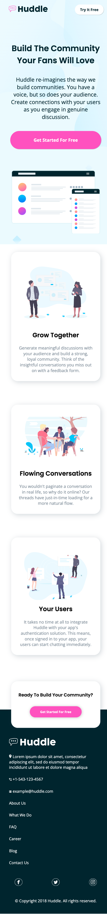
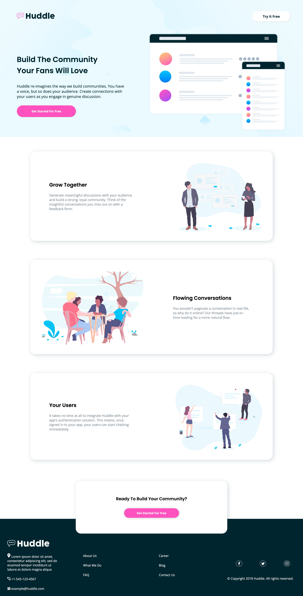

# Frontend Mentor Challenge - Landing page with alternating feature blocks solution

This is a solution to the [Huddle landing page with alternating feature blocks challenge on Frontend Mentor](https://www.frontendmentor.io/challenges/huddle-landing-page-with-alternating-feature-blocks-5ca5f5981e82137ec91a5100). 

## Table of contents

  - [The challenge](#the-challenge)
  - [Screenshot](#screenshot)
  - [Built with](#built-with)
  - [What I learned](#what-i-learned)


### The challenge

Users should be able to:

- View the optimal layout for the site depending on their device's screen size
- See hover states for all interactive elements on the page

### Screenshot





### Built with

- Semantic HTML5 markup
- CSS custom properties
- Flexbox
- Mobile-first workflow (at least I tried to)

### What I learned

<h2>Some HTML code I'm proud of</h2>

```html

<footer>
  <div class="footer-column">
    
    <ul class="contacts">
      <li>
        
        Lorem ipsum dolor sit amet, consectetur adipiscing elit, sed do eiusmod tempor 
          incididunt ut labore et dolore magna aliqua
      </li>
      <li> 
        <a href="tel:+1-543-123-4567">+1-543-123-4567</a></li>
      <li>
        
        <a href="mailto:example@huddle.com">example@huddle.com</a>
      </li>
      </ul>
  </div>

```

<h2>Some CSS code I'm proud of (I tried hard to position this element to overlay the footer)</h2>

```css

   .cta-block {
      background-color: white;
      width: 80%;
      padding: 20px;
      border-radius: 25px;
      margin-top: -40px;
      box-shadow: 4px 4px 20px 0px rgba(34, 60, 80, 0.2);
      position: relative;
      top: 70px;
      text-align: center;
      z-index: 1;
              }

    footer {
      background-color: hsl(192, 100%, 9%);
      position: relative;
      display: flex;
      justify-content: space-between;
      flex-wrap: wrap;
      padding-top: 100px;
      z-index: 0;
      width: 100%;
      min-height: 100px;
      height: auto;
        }
